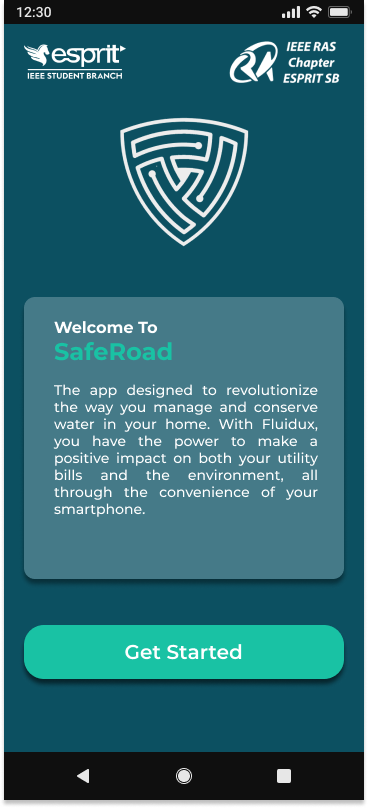
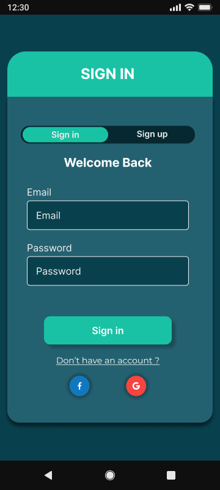
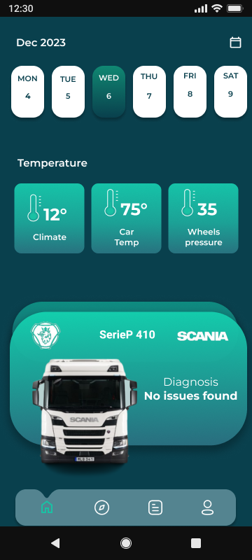
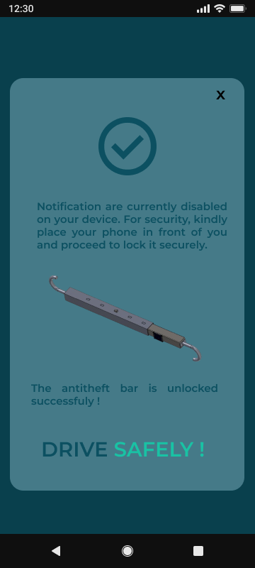
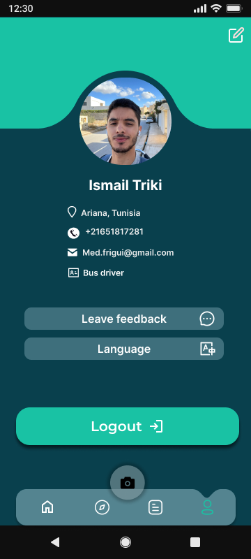

# Drive Guardians - ESPRIT Ras challenge-2023

## Executive Summary

The Drive Guardians aims to address global challenges related to road accidents and car thefts using a combination of AI, Computer Vision, Machine Learning, and IoT technologies. The project introduces a connected anti-theft bar with advanced features to enhance vehicle security and promote driver safety.

### Project Overview

- **Anti-Theft Bar:** Equipped with automatic lock and Bluetooth module linked to ELM327 for enhanced security.
- **Driver Condition Monitoring:** Mobile application detects fatigue, distraction, or intoxication and provides alerts.
- **IoT Integration:** Integrated into the anti-theft bar for improved functionality.
- **Computer Vision System:** Utilizes AI technology for facial detection, driver monitoring, and timely alerts.

## Existing Challenges

In 2021, an estimated 2,497,657 people were injured in police-reported traffic crashes, with distraction-affected crashes accounting for 15% of injuries. Distracted driving plays a substantial role in motor vehicle crashes, highlighting the need for innovative solutions.

## Proposed Solution

The Drive Guardians  combines the anti-theft bar with advanced features and a mobile application for comprehensive security and driver safety. The project integrates IoT, AI, and Computer Vision technologies to provide real-time data, diagnostics, and emergency features.

### Features

1. **Face Detection:** Unlocks the anti-theft bar for authorized users.
2. **Driver Condition Monitoring:** Alerts and makes emergency calls in case of fatigue or distraction.
3. **IoT Integration:** Real-time data on temperature, humidity, and vehicle diagnostics.
4. **Infrared and Phone Camera Options:** Provides flexibility for face detection in various conditions.

## How to Run the Application

To effectively run the Drive Guardians  application, follow these steps:

### 1. Run the Backend-User

#### Prerequisites
- Ensure you have Python and Flask installed on your machine.

#### Steps
1. Open a terminal and navigate to the `backend-user` directory.
   ```bash
   cd backend-user
   ```

2. Install the required dependencies.
   ```bash
   pip install -r requirements.txt
   ```

3. Run the Flask server.
   ```bash
   python app.py
   ```

4. The backend server should now be running. Make note of the server address (e.g., `http://localhost:5000`).

### 2. Run the Frontend Application

#### Prerequisites
- Ensure you have Node.js and React Native installed on your machine.

#### Steps
1. Open a new terminal window and navigate to the `frontend` directory.
   ```bash
   cd frontend
   ```

2. Install the required dependencies.
   ```bash
   npm install
   ```

3. Start the React Native application.
   ```bash
   npx expo start  # or run-ios for iOS
   ```

   Ensure that you have an Android emulator or a connected Android device.

4. The React Native application should now be running.

5. Open the application on your mobile device or emulator and follow the authentication steps as prompted.

### Note
- Make sure both the backend-user and frontend applications are running simultaneously for the complete functionality of the Drive Guardians .

## Technologies Used

### Hardware Technologies

1. **Arduino Nano Board:** Facilitates communication with the vehicle's onboard computer.
2. **ELM327 OBD-II Adapter:** Provides diagnostic capabilities and real-time sensor data.
3. **Bluetooth Module (HC-05):** Enables efficient communication between components.
4. **Electric Lock (12VDC):** Integrated into the anti-theft bar for enhanced security.

### Software Technologies

1. **React Native:** Front-end development for the mobile application.
2. **Flask:** Backend for Computer Vision system.
3. **OpenCV:** Integrated into the Computer Vision system for image and video analysis.
4. **Python:** Primary programming language for AI model development and system integration.
5. **Express.js:** Backend for Authentication and REST APIs.

## Project Architecture

1. **Authentication Page:** User or company account creation with high-security measures.
2. **Detection:** Face detection for unlocking the anti-theft bar.
3. **Home Page:** Access to real-time data, diagnostics, and emergency features.
4. **Details:** More detailed information about the vehicle.
5. **Emergency Call:** Initiates emergency call if the driver does not respond to alerts.

## Prototype Images









## Video Prototype

Watch a brief video prototype showcasing the app's key features and user interactions.


[🎥 Watch Video](https://drive.google.com/drive/folders/1FTuOmquKnwebZ4gwxlVlBkb7pOv7tRuG?fbclid=IwAR3ZKRhIEvs2wkF8DHH1jhC_wwSLqKqqh6gUaH6h_ZLsfTRHsxPZ8xAeRJQ)


